# Discrete Hopfield Networks for Associative Memory: Implementation and Analysis

> **Course Project — Boltzmann Machines & Energy-Based Models**
>
> A modular Python implementation of discrete Hopfield networks with support for Hebbian and Storkey learning rules, asynchronous and synchronous recall dynamics, energy landscape analysis, and publication-quality visualisation.

---

## Table of Contents

1. [Abstract](#abstract)
2. [Theoretical Background](#theoretical-background)
3. [Project Structure](#project-structure)
4. [Implementation Details](#implementation-details)
5. [Environment & Reproducibility](#environment--reproducibility)
6. [Usage](#usage)
7. [Experiments](#experiments)
8. [References](#references)

---

## Abstract

This repository provides a self-contained implementation of the **discrete Hopfield network** (Hopfield, 1982), a canonical energy-based model that functions as a content-addressable (associative) memory. The codebase supports two learning rules—classical Hebbian learning and the Storkey incremental rule—as well as both asynchronous (sequential) and synchronous (parallel) update dynamics. Accompanying analysis tools enable full energy landscape enumeration (for small networks), spurious state detection, basin-of-attraction estimation, and storage capacity benchmarking. All results are presented in an interactive Jupyter notebook with publication-ready figures.

---

## Theoretical Background

### 1. Model Definition

A Hopfield network consists of $N$ binary neurons with states $s_i \in \{-1, +1\}$, interconnected by a symmetric weight matrix $W$ satisfying $w_{ij} = w_{ji}$ and $w_{ii} = 0$.

### 2. Learning Rules

**Hebbian (outer-product) rule.** &ensp; Given $P$ patterns $\boldsymbol{\xi}^{\mu} \in \{-1,+1\}^N$, the weights are set as

$$
w_{ij} = \frac{1}{N} \sum_{\mu=1}^{P} \xi_i^{\mu}\, \xi_j^{\mu}, \qquad w_{ii} = 0.
$$

**Storkey incremental rule.** &ensp; Patterns are incorporated one at a time. At step $\mu$ the weight update is

$$
w_{ij}^{(\mu)} = w_{ij}^{(\mu-1)} + \frac{1}{N}\!\left( \xi_i^{\mu}\xi_j^{\mu} - \xi_i^{\mu}\,h_{j,i}^{(\mu-1)} - h_{i,j}^{(\mu-1)}\,\xi_j^{\mu} \right),
$$

where $h_{i,j}^{(\mu-1)} = \sum_{k \neq j} w_{ik}^{(\mu-1)}\,\xi_k^{\mu}$ is the local field at neuron $i$ excluding the contribution of neuron $j$ (Storkey, 1997).

### 3. Recall Dynamics

Retrieval proceeds by iterating the update rule

$$
s_i(t+1) = \operatorname{sgn}\!\left(\sum_{j} w_{ij}\, s_j(t)\right)
$$

until convergence (fixed point). Two schedules are implemented:

| Mode | Description |
|---|---|
| **Asynchronous** | Neurons are updated one at a time in random order. Guaranteed to converge to a fixed point. |
| **Synchronous** | All neurons are updated simultaneously. May produce limit cycles of period 2. |

### 4. Energy Function

The Lyapunov (energy) function associated with the network is

$$
E(\mathbf{s}) = -\frac{1}{2} \sum_{i \neq j} w_{ij}\, s_i\, s_j = -\frac{1}{2}\, \mathbf{s}^\top W\, \mathbf{s}.
$$

Under asynchronous updates, $E$ is non-increasing at each step, guaranteeing convergence to a local minimum (Hopfield, 1982).

### 5. Pattern Overlap

The overlap between a network state $\mathbf{s}$ and stored pattern $\boldsymbol{\xi}^{\mu}$ is defined as

$$
m^{\mu} = \frac{1}{N} \sum_{i=1}^{N} \xi_i^{\mu}\, s_i \;\in [-1,\,1].
$$

A value of $m^{\mu} = 1$ indicates perfect recall, while $m^{\mu} = -1$ corresponds to retrieval of the complement pattern.

### 6. Storage Capacity

The theoretical storage capacity of a Hopfield network with Hebbian learning is

$$
P_{\max} \approx \frac{N}{2 \ln N}
$$

beyond which cross-talk noise causes catastrophic recall failure (Amit *et al.*, 1985). The Storkey rule raises this bound to $P_{\max} \approx N / \sqrt{2 \ln N}$ (Storkey, 1997).

---

## Project Structure

```
Boltzman Machines/
├── hopfield/                     # Python package
│   ├── __init__.py               # Public API exports
│   ├── network.py                # HopfieldNetwork class (Hebbian & Storkey learning, recall)
│   ├── energy.py                 # EnergyAnalyzer — landscape analysis, attractor search
│   ├── visualization.py          # HopfieldVisualizer — publication-quality plots
│   └── utils.py                  # Pattern generators, noise injection, similarity metrics
├── notebooks/
│   └── hopfield_demo.ipynb       # Interactive experiments & figures
├── figures/                      # Pre-rendered experiment figures (see §Experiments)
├── scripts/
│   └── export_figures.py         # Extract PNGs from executed notebook
├── requirements.txt              # Pinned Python dependencies
└── README.md                     # This document
```

---

## Implementation Details

### `HopfieldNetwork` (network.py)

| Method | Description |
|---|---|
| `train(patterns)` | Store patterns via Hebbian outer-product rule |
| `train_storkey(patterns)` | Store patterns via Storkey incremental rule |
| `recall(state, mode, ...)` | Run async/sync dynamics; optionally record full trajectory |
| `energy(state)` | Compute the Lyapunov energy $E(\mathbf{s})$ |
| `overlap_with_patterns(state)` | Return overlap vector $\mathbf{m}$ with all stored patterns |
| `theoretical_capacity` | $P_{\max} \approx N / (2\ln N)$ |

### `EnergyAnalyzer` (energy.py)

| Method | Description |
|---|---|
| `energy_along_path(history)` | Energy trajectory during recall |
| `stored_pattern_energies()` | Energies of all stored attractors |
| `is_fixed_point(state)` | Stability check under synchronous update |
| `find_spurious_states(n_probes)` | Monte-Carlo search for spurious attractors |
| `enumerate_all_energies()` | Full $2^N$ enumeration (feasible for $N \leq 18$) |
| `find_all_minima()` | All local minima by exhaustive search |
| `estimate_basin_sizes(n_probes)` | Basin-of-attraction fractions via random probing |

### `HopfieldVisualizer` (visualization.py)

Provides methods for pattern grids, weight matrix heatmaps, energy and overlap trajectories, recall comparisons, basin bar charts, energy histograms, and capacity curves—all formatted for inclusion in academic reports.

### Utility Functions (utils.py)

- `generate_random_patterns` — random bipolar vectors
- `make_letter_patterns` — hand-crafted 5 × 5 letter bitmaps (A, C, H, I, L, T, X, O)
- `make_shape_patterns` — geometric shapes (bars, cross, checkerboard, diagonal, border)
- `add_noise` — stochastic bit-flipping at a specified noise level
- `hamming_distance`, `overlap` — similarity metrics

---

## Environment & Reproducibility

### Prerequisites

- Python ≥ 3.9

### Installation

```bash
# 1. Create and activate a virtual environment (recommended)
python -m venv .venv
# Windows
.venv\Scripts\activate
# macOS / Linux
source .venv/bin/activate

# 2. Install dependencies
pip install -r requirements.txt
```

All random number generators in the codebase accept an explicit `seed` parameter or use `numpy.random.default_rng` for reproducible experiments.

---

## Usage

### Interactive Notebook

```bash
jupyter notebook notebooks/hopfield_demo.ipynb
```

### Programmatic Usage

```python
import numpy as np
from hopfield import HopfieldNetwork, EnergyAnalyzer, HopfieldVisualizer
from hopfield.utils import generate_random_patterns, add_noise

# Initialise network
net = HopfieldNetwork(n_neurons=100)

# Store random patterns
patterns = generate_random_patterns(n_patterns=3, n_neurons=100, seed=42)
net.train(patterns)

# Create a noisy probe and recall
probe = add_noise(patterns[0], noise_level=0.2)
recalled, info = net.recall(probe, mode="async", record_history=True)

# Analyse energy landscape
analyzer = EnergyAnalyzer(net)
print("Pattern energies:", analyzer.stored_pattern_energies())

# Visualise
viz = HopfieldVisualizer(net, grid_shape=(10, 10))
viz.show_recall_comparison(patterns[0], probe, recalled)
viz.plot_energy_trajectory(info["energy_history"])
```

---

## Experiments

The accompanying notebook ([hopfield_demo.ipynb](notebooks/hopfield_demo.ipynb)) contains the following experiments. All figures were generated with the settings listed in the notebook's configuration cell ($N = 100$, $P = 6$, seed $= 42$).

---

### Exp. 1 — Pattern Storage (Hebbian Learning)

Six random bipolar patterns stored via the outer-product rule.

<p align="center">
  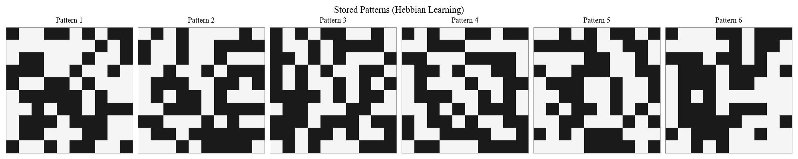
</p>

---

### Exp. 2 — Pattern Recall from Noisy Input

Recall quality at increasing noise levels ($\eta = 10\%$–$50\%$). The network recovers the original pattern up to moderate corruption.

<p align="center">
  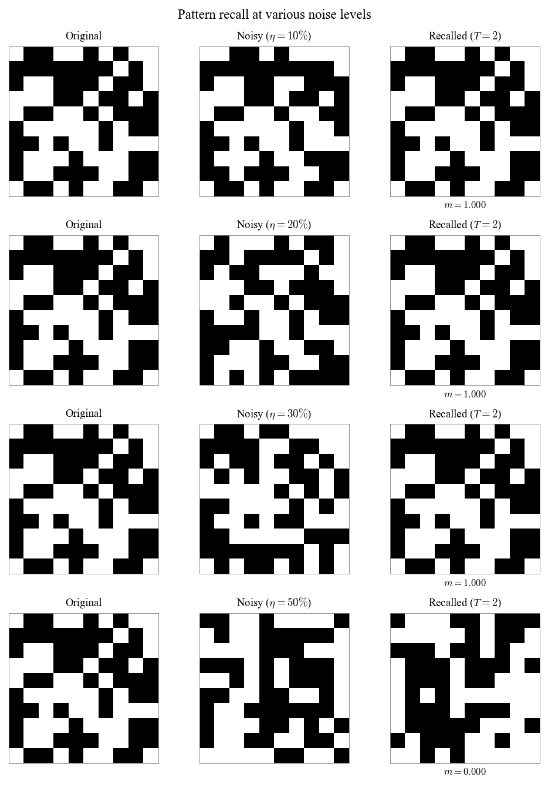
</p>

---

### Exp. 3 — Energy Trajectory During Recall

The Lyapunov energy $E(\mathbf{s})$ decreases monotonically under asynchronous updates, confirming convergence to a local minimum.

<p align="center">
  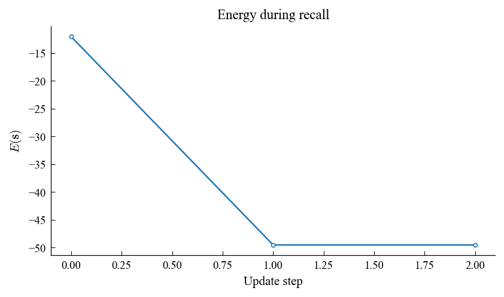
</p>

---

### Exp. 4 — Weight Matrix Structure

Heatmap of the learned weight matrix $W \in \mathbb{R}^{N \times N}$. Symmetry ($w_{ij} = w_{ji}$) and zero diagonal are clearly visible.

<p align="center">
  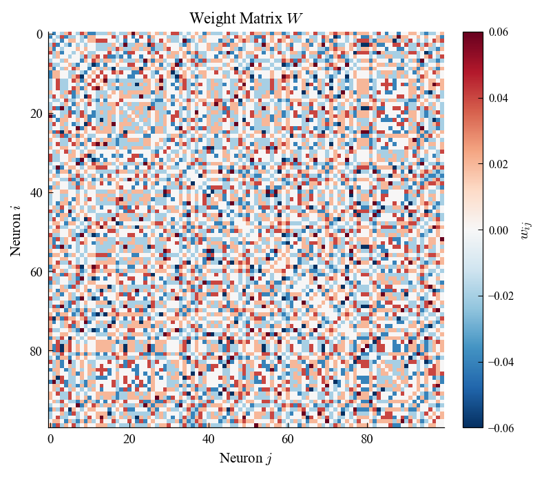
</p>

---

### Exp. 5 — Overlap Dynamics

Overlap $m^{\mu}(t)$ with each stored pattern during recall. The target pattern's overlap converges to $+1$ while others remain near $0$.

<p align="center">
  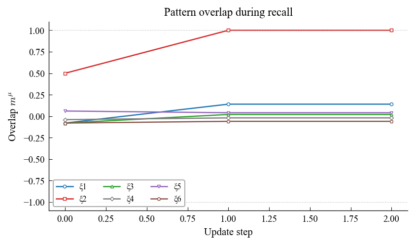
</p>

---

### Exp. 6 — Asynchronous vs. Synchronous Dynamics

Energy descent and state filmstrips for both update schedules. Asynchronous updates guarantee monotonic energy decrease.

<p align="center">
  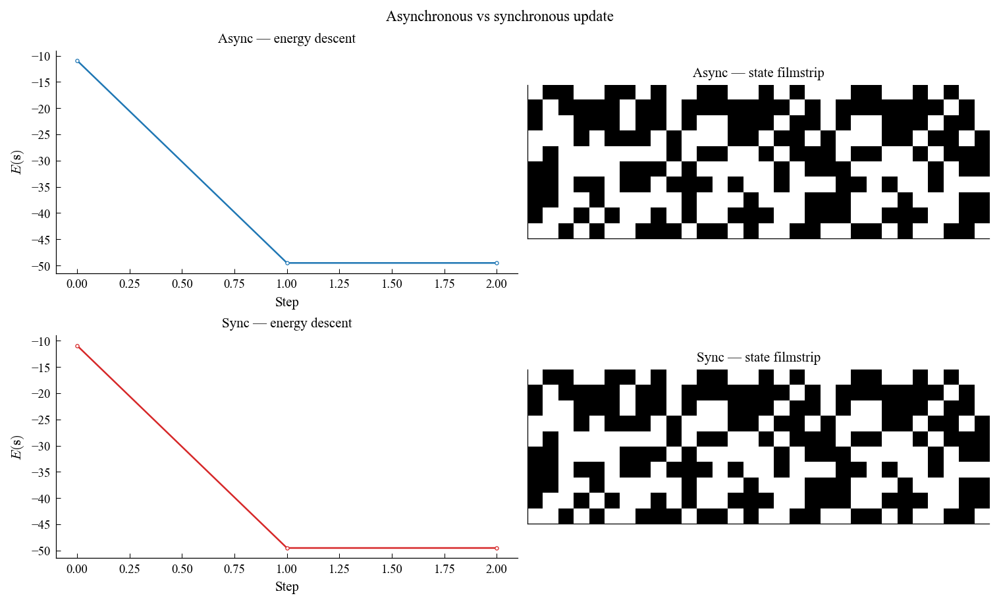
</p>

Quantitative comparison across noise levels (overlap, convergence speed, wall time, convergence rate):

<p align="center">
  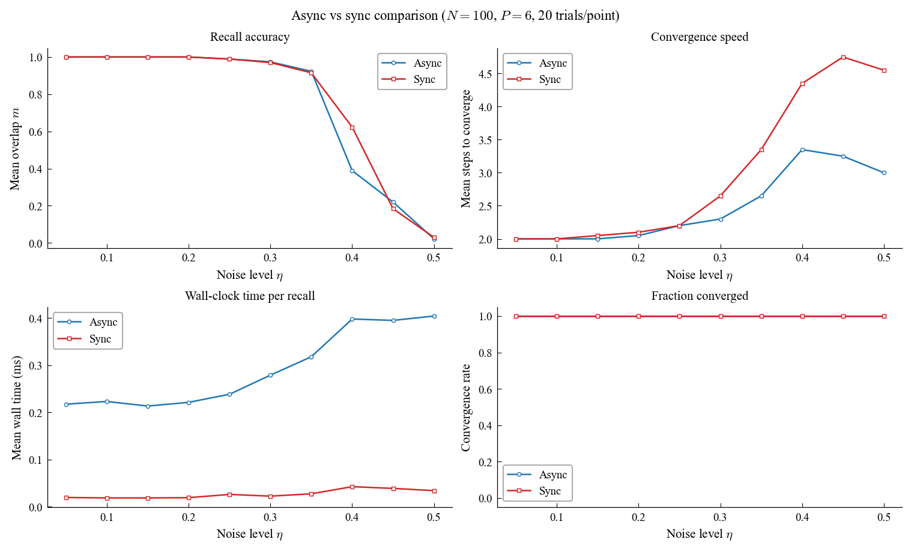
</p>

---

### Exp. 7 — Storage Capacity Curve

Empirical recall success rate vs. number of stored patterns ($N = 200$). The dashed line marks the theoretical bound $P_{\max} \approx N/(2 \ln N)$.

<p align="center">
  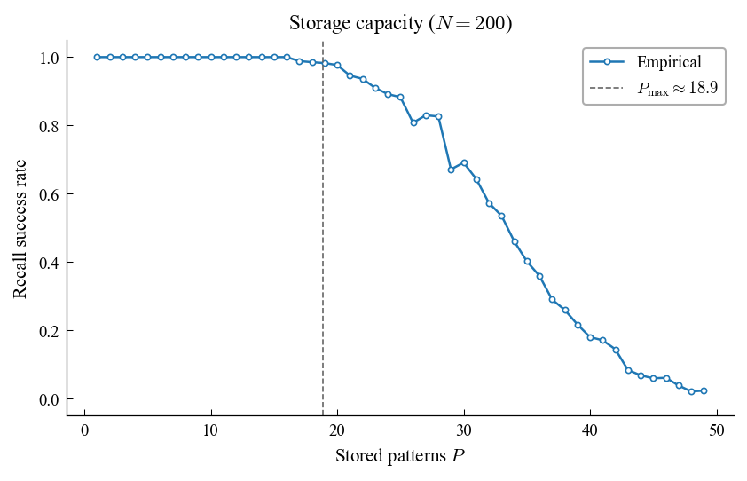
</p>

---

### Exp. 8 — Hebbian vs. Storkey Learning

The Storkey incremental rule sustains high recall accuracy well beyond the Hebbian capacity limit.

<p align="center">
  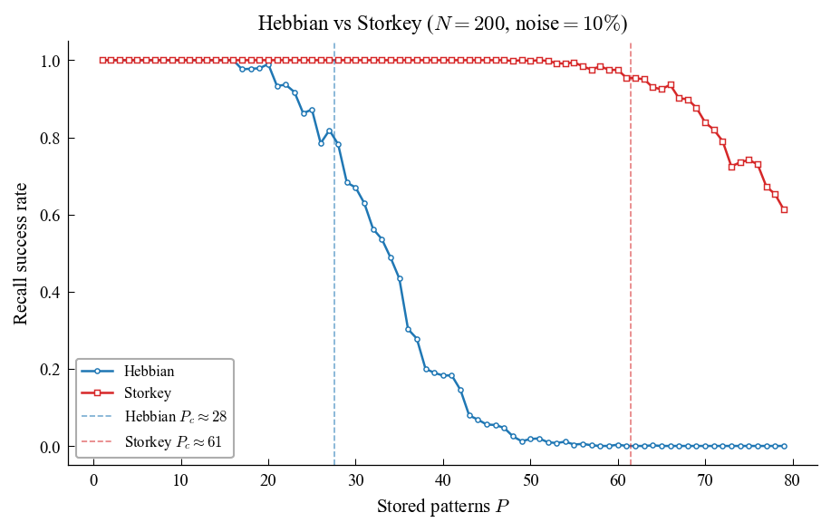
</p>

---

### Exp. 9 — Basin of Attraction Estimation

Fraction of random initial states that converge to each stored pattern, estimated by Monte-Carlo probing ($2\,000$ samples).

<p align="center">
  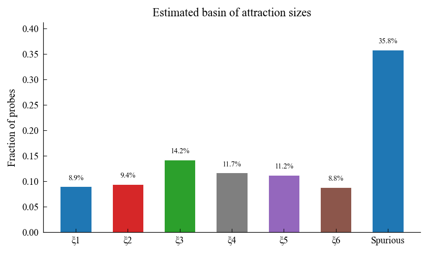
</p>

---

### Exp. 10 — Spurious States

Stored patterns (top row) compared with discovered spurious attractors (bottom row) and their overlap vectors.

<p align="center">
  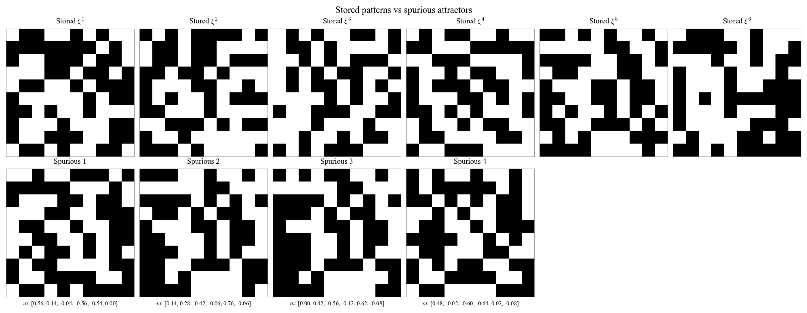
</p>

---

### Exp. 11 — Letter Pattern Recognition

Hand-crafted $5 \times 5$ letter bitmaps stored and recalled from noisy probes, with per-letter energy trajectories.

<p align="center">
  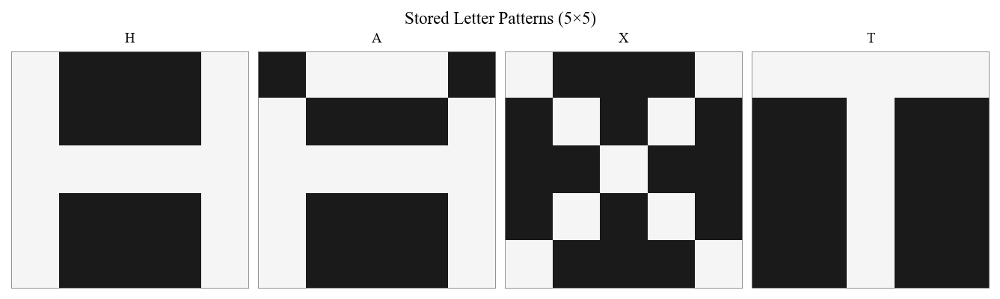
</p>

<p align="center">
  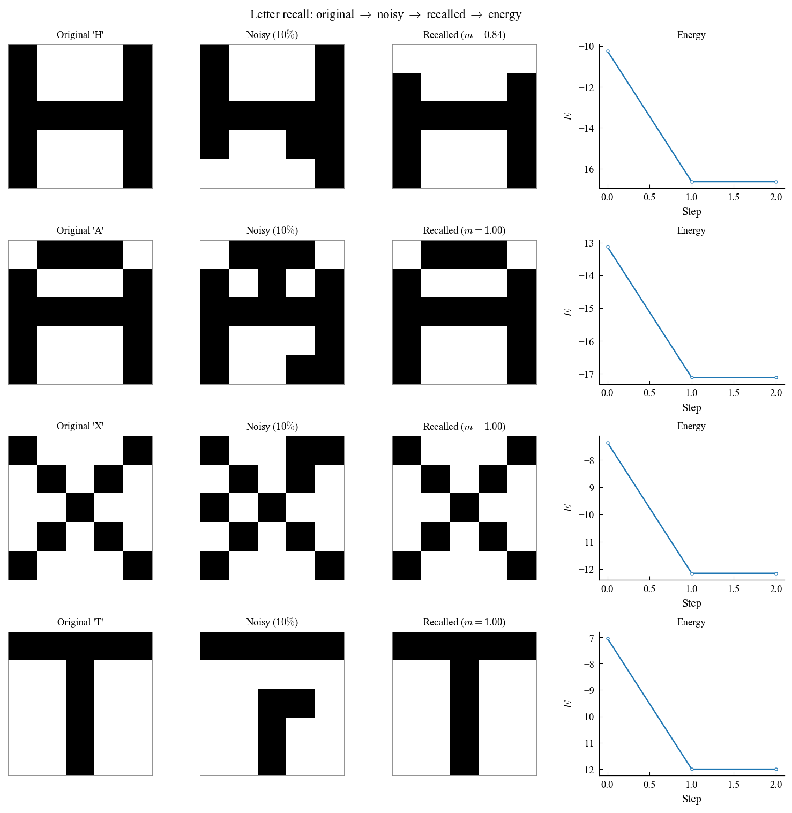
</p>

---

### Exp. 12 — Convergence Speed Heatmap

Mean number of update steps to reach a fixed point, as a function of noise level and pattern load.

<p align="center">
  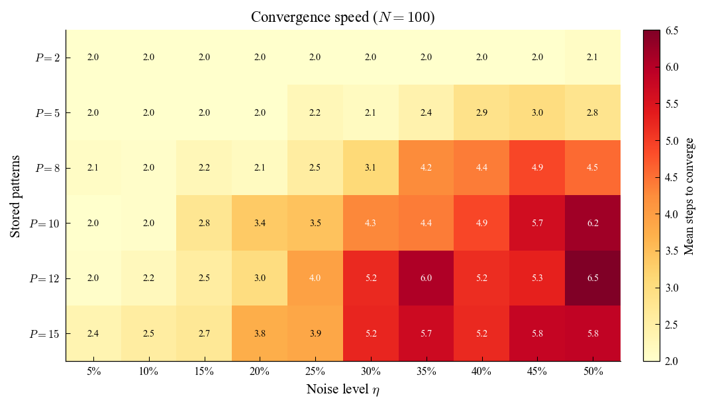
</p>

---

## References

1. Hopfield, J. J. (1982). Neural networks and physical systems with emergent collective computational abilities. *Proceedings of the National Academy of Sciences*, 79(8), 2554–2558.
2. Amit, D. J., Gutfreund, H., & Sompolinsky, H. (1985). Storing infinite numbers of patterns in a spin-glass model of neural networks. *Physical Review Letters*, 55(14), 1530–1533.
3. Storkey, A. J. (1997). Increasing the capacity of a Hopfield network without sacrificing functionality. In *Artificial Neural Networks — ICANN '97* (pp. 451–456). Springer.
4. Hertz, J., Krogh, A., & Palmer, R. G. (1991). *Introduction to the Theory of Neural Computation*. Addison-Wesley.
5. Amit, D. J. (1989). *Modeling Brain Function: The World of Attractor Neural Networks*. Cambridge University Press.

---

<sub>Last updated: March 2026</sub>
